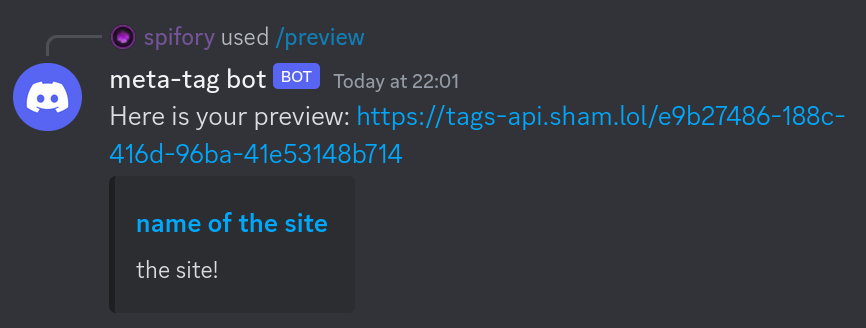
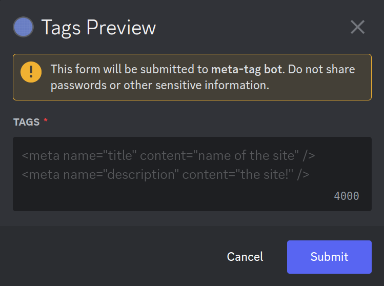

# tags-bot

A bot that helps with previewing your Meta/OpenGraph tags before you use them on your site.

This is the actual Discord bot that displays the previews on Discord whilst also just allowing you not to make any manual API requests.

## Self-Hosting

Firstly make sure that you have done everything required in the [/api/README.md](/api/README.md) file, as this bot heavily relies on the API.

Secondly, fill in the the environment variables in the [./.env](./.env) file. All you need to do is fill in the following variables:

```sh
# The bot's token to post the commands on.
BOT_TOKEN=...

# The public key of the bot's application.
PUBLIC_KEY=...

# The API's authorisation key. Currently not useful, can be left empty.
API_AUTH_KEY=...

# The API URL to send requests to. Can be set to localhost during development as well.
API_URL=...
```

Once that is done, simply run `docker-compose up`, and watch it become alive!

## Previews







## Tools Used

- [hikari](https://hikari-py.dev) & [hikari-crescent](https://hikari-crescent.github.io/book/) for interacting with Discord

- [Docker](https://docs.docker.com) & [docker-compose](https://docs.docker.com/compose) for containers and easy start-ups

- [Poetry](https://python-poetry.org) for package management